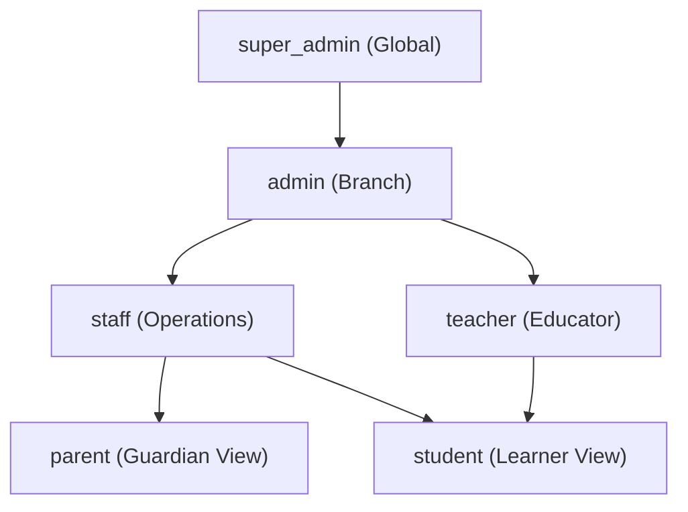

# Educational Academy Platform - User Roles & Authorization Hierarchy (USER_ROLES.md)

## 1. Canonical System Roles

The platform strictly implements 6 canonical user roles. These identifiers MUST NOT be modified or replaced:

```postgresql
CREATE TYPE user_role AS ENUM (
    'super_admin',
    'admin',
    'staff',
    'teacher',
    'parent',
    'student'
);
```

---

## 2. Role Definitions & Scope

### 2.1 `super_admin` (Super Administrator)
- **Scope:** Multi-Tenant / Global Platform Scope.
- **Responsibilities:**
  - Platform-wide system management.
  - Creation and management of top-level Branches/Organizations.
  - Allocation of System Administrators (`admin`).
  - System configuration, feature flag control, global audit log inspection.
  - Database schema management and global operational override.
- **Data Access:** Full read/write access across all branches, tables, and system logs bypasses standard tenant filters (enforced via `super_admin` security bypass functions/RLS policies).

### 2.2 `admin` (Branch / Academy Administrator)
- **Scope:** Branch Scope (Single or multi-assigned branches).
- **Responsibilities:**
  - Operational oversight of assigned branch(es).
  - Staff onboarding, teacher assignment, group allocation.
  - Subject and curriculum publishing approval.
  - Branch financial accounting, invoice pricing plans, and refund authorizations.
  - Branch analytics and compliance reporting.
- **Data Access:** Full access to all data scoped to their assigned `branch_id`.

### 2.3 `staff` (Administrative Operations Staff)
- **Scope:** Branch Scope.
- **Responsibilities:**
  - Student registration, parent-child account linking, group enrollment.
  - Class schedule maintenance, room booking, calendar updates.
  - Attendance override recording, leave request processing, compensation lesson assignment.
  - Payment receipt collection, cash ledger entries, manual invoice status updates.
- **Data Access:** Operational read/write within assigned branch; cannot alter system security configurations, create admins, or delete core audit logs.

### 2.4 `teacher` (Educator)
- **Scope:** Group / Classroom Scope.
- **Responsibilities:**
  - Delivery of curriculum, units, and lessons for assigned groups.
  - Authoring homework, building question banks, constructing exams.
  - Grading homework and subjective exam submissions with feedback.
  - Recording live session attendance and flagging struggling students.
  - Student & Parent direct messaging for educational support.
- **Data Access:** Read access to enrolled student profiles in assigned groups; write access to own created assignments, grades, attendance records, and learning resources.

### 2.5 `parent` (Guardian)
- **Scope:** Linked Children Scope.
- **Responsibilities:**
  - Monitoring academic progress, homework completion, exam grades, and XP growth of linked children.
  - Reviewing attendance history and submitting leave requests.
  - Paying tuition invoices, viewing subscription billing, downloading receipts.
  - Direct communication with group teachers and branch staff.
- **Data Access:** Restricted strictly via RLS to records explicitly linked via `parent_child_links` table.

### 2.6 `student` (Learner)
- **Scope:** Self Enrolled Scope.
- **Responsibilities:**
  - Consuming published lessons, video streams, and smart PDF materials.
  - Taking notes, highlighting PDFs, practicing in the Code Playground.
  - Submitting homework assignments and taking online exams.
  - Reviewing own study replay telemetry and tracking leaderboard gamification.
- **Data Access:** Restricted strictly to self profile, own enrolled groups/lessons, own submissions, own notes, and public branch notices.

---

## 3. Role Inheritance & Hierarchy Map



---

## 4. Role Assignment & Lifecycle Rules
1. Role identifier is stored as a PostgreSQL `user_role` enum in `public.profiles`.
2. Initial signup grants `student` role by default unless overridden by an `admin` or `super_admin`.
3. Role promotions/demotions can ONLY be executed by `admin` (up to `staff`/`teacher`) or `super_admin` (up to `admin`).
4. Changing a user's role immediately invalidates active session tokens or triggers real-time RLS authorization updates.
